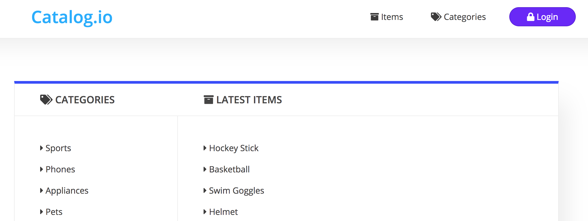

# Catalog.io
#### No, that's not a real name



## Description

An item catalog that leverages Google's Oauth 2 API, allowing users to create, edit, and delete their own items. If you don't want to login, that's cool too, you can view all of the assorted products and categories until your family becomes concerned over your newfound obsession.

## File Structure

* app.py
* /templates
* /views
* config.py
* seeds.py
* database_setup.py

## Dependencies

* flask
* flask_assets
* sqlalchemy
* oauth2client

## How to Use

* Clone the repo onto your computer
* Install the necessary dependencies
* To leverage the Google+ Oauth, you'll need to create your own client_id and client_secret and store them as ```secrets.json``` in your top level directory.
* If you want to populate the database before using, run ```python3 seeds.py``` in your terminal.
* Additional database models can be added to the database_setup.py file but will need a migration to work, or use a different database.
* API endpoints can be accessed via GET requests through the ```/api/categories``` and ```/api/items``` routes respectively

